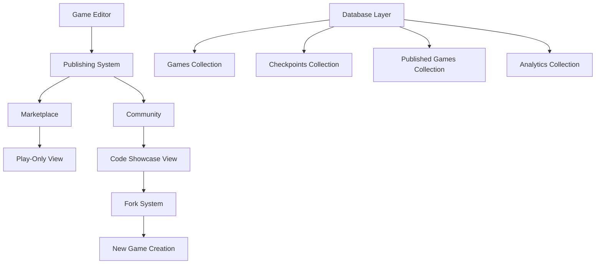

# Design Document

## Overview

The Game Publishing System extends the existing Jeu Plaza platform to enable users to publish their games to two distinct visibility modes: Marketplace and Community. This system builds upon the existing wallet-based ownership model and checkpoint system to provide controlled sharing and collaboration features.

## Architecture

### High-Level Architecture



### Data Flow

1. **Publishing Flow**: User clicks publish button → System validates game has checkpoints → Creates published game entry → Updates game visibility status
2. **Marketplace Flow**: User browses marketplace → Clicks game → Opens play-only view with embedded game
3. **Community Flow**: User browses community → Clicks game → Opens showcase view with code and fork option
4. **Fork Flow**: User clicks fork → System creates new game with copied code → Redirects to editor

## Components and Interfaces

### Database Schema Extensions

#### Published Games Collection
```typescript
interface PublishedGame {
  _id?: ObjectId;
  gameId: string; // Reference to original game
  walletAddress: string; // Original creator
  title: string;
  description?: string;
  publishType: 'marketplace' | 'community';
  checkpointId: string; // Published version
  html: string; // Cached for performance
  css: string; // Cached for performance
  javascript: string; // Cached for performance
  thumbnail?: string; // Generated preview image
  tags: string[];
  playCount: number;
  forkCount: number;
  isActive: boolean; // Can be unpublished
  publishedAt: Date;
  updatedAt: Date;
}
```

#### Game Analytics Collection
```typescript
interface GameAnalytics {
  _id?: ObjectId;
  publishedGameId: string;
  eventType: 'play' | 'fork' | 'view';
  walletAddress?: string; // User who performed action
  timestamp: Date;
  metadata?: Record<string, any>;
}
```

#### Updated Game Model
```typescript
interface Game {
  // ... existing fields
  publishStatus?: {
    marketplace: boolean;
    community: boolean;
    publishedGameId?: string;
  };
}
```

### React Components

#### Editor Components
- `PublishButtons` - Two buttons for marketplace and community publishing
- `PublishDialog` - Modal for publishing configuration (title, description, tags)
- `PublishStatusIndicator` - Shows current publication status

#### Marketplace Components
- `MarketplaceGrid` - Grid layout for published games
- `MarketplaceGameCard` - Individual game card with play button
- `GamePlayer` - Full-screen game player component
- `MarketplaceFilters` - Search and filter controls

#### Community Components
- `CommunityGrid` - Grid layout for community games
- `CommunityGameCard` - Game card with code preview and fork button
- `CodeShowcase` - Component displaying game code with syntax highlighting
- `ForkDialog` - Modal for forking games with customization options

#### Shared Components
- `GamePreview` - Embedded iframe for game preview
- `GameMetrics` - Display play count, fork count, etc.
- `CreatorProfile` - Show creator wallet address and stats

### API Endpoints (Server Actions)

#### Publishing Actions
```typescript
// Publish game to marketplace or community
publishGame(input: {
  gameId: string;
  walletAddress: string;
  publishType: 'marketplace' | 'community';
  title: string;
  description?: string;
  tags: string[];
}): Promise<PublishedGame>

// Unpublish game
unpublishGame(input: {
  gameId: string;
  walletAddress: string;
  publishType?: 'marketplace' | 'community';
}): Promise<boolean>

// Update published game
updatePublishedGame(input: {
  publishedGameId: string;
  walletAddress: string;
  title?: string;
  description?: string;
  tags?: string[];
}): Promise<PublishedGame>
```

#### Browse Actions
```typescript
// Get marketplace games
getMarketplaceGames(input: {
  page?: number;
  limit?: number;
  search?: string;
  tags?: string[];
  sortBy?: 'recent' | 'popular' | 'plays';
}): Promise<PublishedGame[]>

// Get community games
getCommunityGames(input: {
  page?: number;
  limit?: number;
  search?: string;
  tags?: string[];
  sortBy?: 'recent' | 'popular' | 'forks';
}): Promise<PublishedGame[]>

// Get published game by ID
getPublishedGame(input: {
  publishedGameId: string;
}): Promise<PublishedGame | null>
```

#### Fork Actions
```typescript
// Fork a community game
forkGame(input: {
  publishedGameId: string;
  walletAddress: string;
  newGameName: string;
}): Promise<GameClient>

// Get fork history
getForkHistory(input: {
  originalGameId: string;
}): Promise<ForkRelation[]>
```

#### Analytics Actions
```typescript
// Record game interaction
recordGameEvent(input: {
  publishedGameId: string;
  eventType: 'play' | 'fork' | 'view';
  walletAddress?: string;
}): Promise<void>

// Get game analytics
getGameAnalytics(input: {
  publishedGameId: string;
  walletAddress: string; // Must be creator
}): Promise<GameAnalytics[]>
```

## Data Models

### Publishing Workflow
1. **Validation**: Check if game has at least one checkpoint
2. **Content Preparation**: Get latest checkpoint code and metadata
3. **Thumbnail Generation**: Create preview image from game HTML
4. **Database Transaction**: Create published game entry and update original game status
5. **Cache Warming**: Pre-generate any necessary cached data

### Fork Workflow
1. **Source Validation**: Verify published game exists and is community type
2. **Game Creation**: Create new game with forked content
3. **Checkpoint Creation**: Create initial checkpoint with copied code
4. **Relationship Tracking**: Record fork relationship for attribution
5. **Analytics Update**: Increment fork count on original game

### Search and Discovery
- **Full-text search** on game titles and descriptions
- **Tag-based filtering** for categorization
- **Sorting options**: Recent, Popular (by plays/forks), Alphabetical
- **Creator filtering**: Find games by specific wallet addresses

## Error Handling

### Publishing Errors
- **No Checkpoints**: Prevent publishing if game has no saved checkpoints
- **Duplicate Publishing**: Handle attempts to republish already published games
- **Ownership Validation**: Ensure only game owners can publish their games
- **Content Validation**: Validate HTML/CSS/JS for security concerns

### Fork Errors
- **Source Not Found**: Handle attempts to fork non-existent or unpublished games
- **Marketplace Fork**: Prevent forking of marketplace-only games
- **Name Conflicts**: Handle duplicate game names in user's collection
- **Quota Limits**: Implement reasonable limits on fork frequency

### Browse Errors
- **Invalid Pagination**: Handle out-of-range page requests
- **Malformed Filters**: Validate search and filter parameters
- **Game Load Failures**: Graceful handling of corrupted or missing game data

## Testing Strategy

### Unit Tests
- **Publishing Logic**: Test all publishing workflows and validations
- **Fork System**: Test game copying and relationship tracking
- **Analytics**: Test event recording and aggregation
- **Search**: Test filtering and sorting algorithms

### Integration Tests
- **End-to-End Publishing**: Test complete publish-to-browse workflow
- **Fork-to-Edit**: Test forking and immediate editing workflow
- **Multi-User Scenarios**: Test concurrent publishing and forking
- **Database Consistency**: Test transaction integrity

### Performance Tests
- **Browse Performance**: Test large game collections with pagination
- **Search Performance**: Test search with various query types
- **Fork Performance**: Test bulk forking operations
- **Analytics Performance**: Test high-frequency event recording

### Security Tests
- **Ownership Validation**: Test unauthorized publishing attempts
- **Code Injection**: Test XSS prevention in published games
- **Rate Limiting**: Test abuse prevention mechanisms
- **Data Privacy**: Test wallet address handling and privacy

## UI/UX Considerations

### Editor Integration
- **Prominent Buttons**: Make publishing options easily discoverable
- **Status Indicators**: Clear visual feedback on publication status
- **Quick Actions**: One-click republishing for updates

### Browse Experience
- **Responsive Grid**: Optimized for desktop and mobile viewing
- **Quick Preview**: Hover or tap to preview games without full navigation
- **Creator Attribution**: Clear display of game creators
- **Performance**: Fast loading with lazy loading and caching

### Game Player
- **Full-Screen Mode**: Immersive game playing experience
- **Mobile Controls**: Touch-friendly controls for mobile games
- **Error Handling**: Graceful handling of broken or incompatible games
- **Social Features**: Easy sharing and rating mechanisms

## Performance Optimizations

### Caching Strategy
- **Published Game Cache**: Cache rendered game content for fast loading
- **Search Results Cache**: Cache popular search queries
- **Analytics Cache**: Pre-aggregate popular metrics
- **CDN Integration**: Serve static game assets from CDN

### Database Optimizations
- **Indexes**: Optimize queries for browsing and searching
- **Aggregation Pipelines**: Efficient analytics calculations
- **Connection Pooling**: Optimize database connection usage
- **Read Replicas**: Separate read/write operations for scalability

### Frontend Optimizations
- **Code Splitting**: Load publishing features only when needed
- **Image Optimization**: Optimize game thumbnails and previews
- **Lazy Loading**: Load game content on demand
- **Service Workers**: Cache frequently accessed games offline