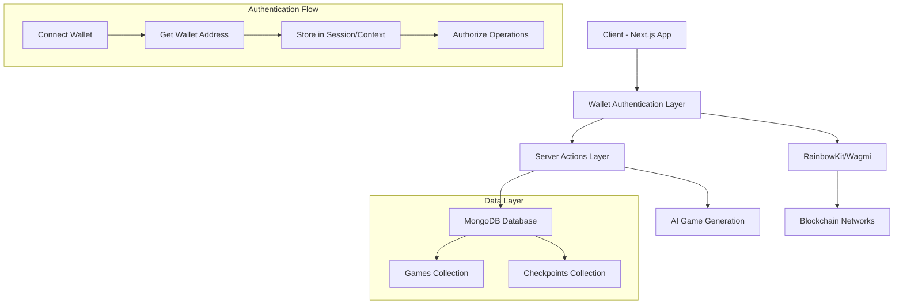

# Design Document

## Overview

This design implements wallet-based game storage for the existing AI-powered Canvas Game Editor. The system will integrate with the current RainbowKit wallet authentication to associate games and checkpoints with specific wallet addresses, ensuring user ownership and privacy. The design leverages the existing MongoDB infrastructure and extends the current data models to include wallet-based ownership.

## Architecture

### High-Level Architecture



### Component Architecture

The system will extend the existing component structure:

- **Wallet Context Provider**: Manages wallet state across the application
- **Protected Routes**: Middleware to ensure wallet authentication
- **Enhanced Server Actions**: Modified to include wallet address validation
- **Database Models**: Extended to include wallet ownership fields

## Components and Interfaces

### 1. Wallet Authentication Integration

#### WalletContext Provider
```typescript
interface WalletContextType {
  address: string | null;
  isConnected: boolean;
  isLoading: boolean;
  connect: () => Promise<void>;
  disconnect: () => void;
}
```

The existing `Providers` component will be enhanced to include wallet state management using wagmi hooks.

#### Authentication Middleware
A custom hook `useRequireWallet` will be created to protect routes and components that require wallet authentication.

### 2. Enhanced Data Models

#### Game Model
```typescript
interface Game {
  _id?: string;          // MongoDB ObjectId as string
  name: string;
  walletAddress: string; // NEW: Owner's wallet address
  description?: string;
  currentCheckpointId?: string; // Reference to current checkpoint
  createdAt: Date;
  updatedAt: Date;
  isPrivate: boolean; // NEW: Privacy setting (default: true)
}
```

#### Checkpoint Model
```typescript
interface Checkpoint {
  _id?: string;          // MongoDB ObjectId as string
  gameId: string;        // Reference to parent game
  walletAddress: string; // NEW: Owner's wallet address
  prompt: string;
  html: string;
  css: string;
  javascript: string;
  description: string;
  version: number;
  createdAt: Date;
}
```

### 3. Enhanced Server Actions

#### Game Management Actions
```typescript
// lib/actions.ts
export async function createGame(name: string, walletAddress: string): Promise<Game>
export async function getUserGames(walletAddress: string): Promise<Game[]>
export async function getGameById(gameId: string, walletAddress: string): Promise<Game | null>
export async function deleteGame(gameId: string, walletAddress: string): Promise<boolean>
```

#### Checkpoint Management Actions
```typescript
export async function saveCheckpoint(data: {
  gameId: string;
  walletAddress: string;
  prompt: string;
  html: string;
  css: string;
  javascript: string;
  description: string;
}): Promise<Checkpoint>

export async function getGameCheckpoints(gameId: string, walletAddress: string): Promise<Checkpoint[]>
export async function deleteCheckpoint(checkpointId: string, walletAddress: string): Promise<boolean>
```

### 4. Database Layer

#### MongoDB Connection
The existing `lib/mongodb.ts` will be implemented with the standard Next.js MongoDB pattern:

```typescript
import { MongoClient } from 'mongodb';

const uri = process.env.MONGODB_URI!;
const options = {};

let client: MongoClient;
let clientPromise: Promise<MongoClient>;

if (process.env.NODE_ENV === 'development') {
  if (!(global as any)._mongoClientPromise) {
    client = new MongoClient(uri, options);
    (global as any)._mongoClientPromise = client.connect();
  }
  clientPromise = (global as any)._mongoClientPromise;
} else {
  client = new MongoClient(uri, options);
  clientPromise = client.connect();
}

export default clientPromise;
```

#### Database Indexes
The following indexes will be created for optimal performance:
- `games.walletAddress` (ascending)
- `checkpoints.walletAddress` (ascending)
- `checkpoints.gameId` (ascending)
- `games.createdAt` (descending)

### 5. Frontend Components

#### Enhanced Home Page (`app/page.tsx`)
- Display user's games in a grid layout
- Show game metadata (name, creation date, checkpoint count)
- Provide create new game functionality
- Handle empty state for new users

#### Enhanced Editor Page (`app/editor/[gameId]/page.tsx`)
- Verify game ownership before rendering
- Load game data and checkpoints for authenticated user
- Integrate with existing editor components

#### Game Management Components
- **GameCard**: Display individual game information
- **GameGrid**: Layout for displaying multiple games
- **CreateGameDialog**: Modal for creating new games
- **DeleteGameDialog**: Confirmation dialog for game deletion

## Data Models

### Database Schema

#### Games Collection
```json
{
  "_id": "ObjectId (stored as string in TypeScript)",
  "name": "string",
  "walletAddress": "string (indexed)",
  "description": "string (optional)",
  "currentCheckpointId": "string (optional, references checkpoint _id)",
  "createdAt": "Date",
  "updatedAt": "Date",
  "isPrivate": "boolean (default: true)"
}
```

#### Checkpoints Collection
```json
{
  "_id": "ObjectId (stored as string in TypeScript)",
  "gameId": "string (indexed, references game _id)",
  "walletAddress": "string (indexed)",
  "prompt": "string",
  "html": "string",
  "css": "string", 
  "javascript": "string",
  "description": "string",
  "version": "number",
  "createdAt": "Date"
}
```

### Data Validation

All server actions will include validation using Zod schemas:

```typescript
const CreateGameSchema = z.object({
  name: z.string().min(1).max(100),
  walletAddress: z.string().regex(/^0x[a-fA-F0-9]{40}$/),
  description: z.string().optional()
});

const SaveCheckpointSchema = z.object({
  gameId: z.string(),
  walletAddress: z.string().regex(/^0x[a-fA-F0-9]{40}$/),
  prompt: z.string().min(1),
  html: z.string(),
  css: z.string(),
  javascript: z.string(),
  description: z.string()
});
```

## Error Handling

### Authentication Errors
- **Wallet Not Connected**: Redirect to connection prompt
- **Invalid Wallet Address**: Display error message and request reconnection
- **Session Expired**: Prompt user to reconnect wallet

### Authorization Errors
- **Unauthorized Access**: Return 403 with clear error message
- **Game Not Found**: Return 404 with helpful message
- **Ownership Violation**: Log security event and return 403

### Database Errors
- **Connection Failures**: Implement retry logic with exponential backoff
- **Validation Errors**: Return detailed field-level error messages
- **Constraint Violations**: Handle duplicate keys and foreign key constraints

### Error Response Format
```typescript
interface ErrorResponse {
  success: false;
  error: {
    code: string;
    message: string;
    details?: any;
  };
}
```

## Testing Strategy

### Unit Testing
- **Server Actions**: Test all CRUD operations with mock wallet addresses
- **Data Validation**: Test Zod schemas with valid and invalid inputs
- **Database Operations**: Test with in-memory MongoDB instance
- **Wallet Integration**: Mock wagmi hooks for component testing

### Integration Testing
- **Authentication Flow**: Test complete wallet connection and disconnection
- **Game Lifecycle**: Test create, read, update, delete operations
- **Checkpoint Management**: Test saving and loading checkpoints
- **Cross-User Isolation**: Verify users can only access their own data

### End-to-End Testing
- **User Journey**: Test complete flow from wallet connection to game creation
- **Multi-User Scenarios**: Test data isolation between different wallet addresses
- **Error Scenarios**: Test handling of network failures and invalid states

### Security Testing
- **Authorization**: Verify ownership checks for all operations
- **Input Validation**: Test SQL injection and XSS prevention
- **Session Management**: Test wallet disconnection and reconnection flows

### Performance Testing
- **Database Queries**: Ensure indexes are used effectively
- **Large Dataset**: Test with multiple games and checkpoints per user
- **Concurrent Users**: Test system behavior under load

### Test Data Setup
```typescript
const testWalletAddresses = [
  '0x1234567890123456789012345678901234567890',
  '0x0987654321098765432109876543210987654321'
];

const createTestGame = (walletAddress: string) => ({
  name: 'Test Game',
  walletAddress,
  description: 'A test game',
  isPrivate: true
});
```

The testing strategy ensures that wallet-based ownership is properly enforced and that the system maintains data integrity across all user interactions.