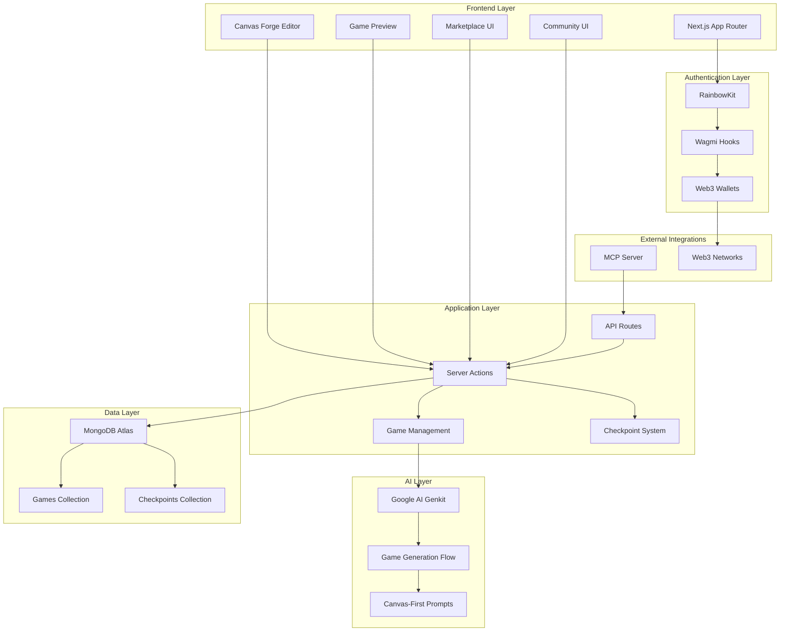
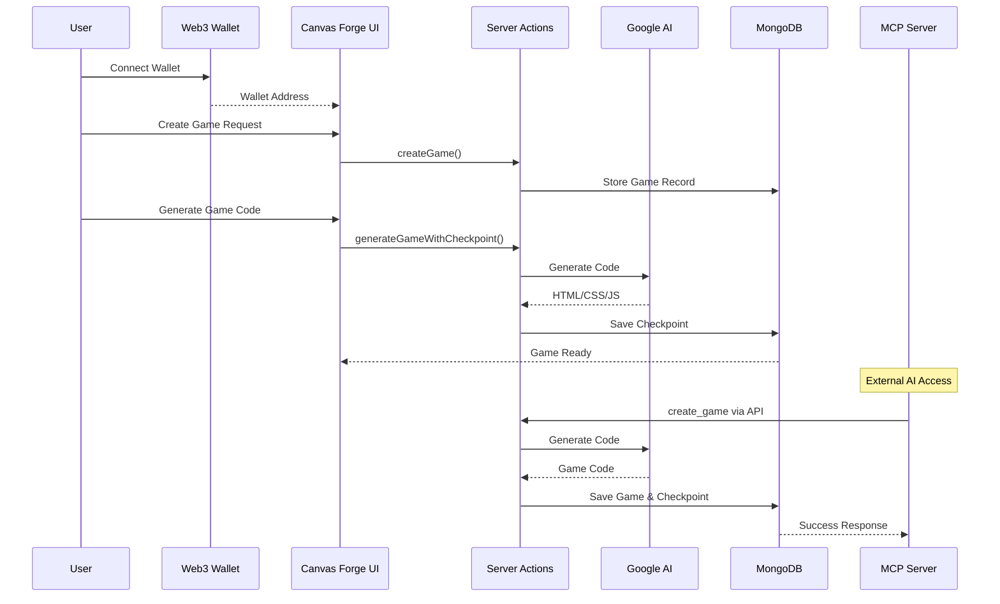

# Jeu Plaza

## 📋 Overview

**Jeu Plaza** is a Canvas Game Editor platform that enables AI-powered HTML5 Canvas game creation with Web3 wallet-based ownership. Users can generate, edit, and publish games through an integrated development environment with checkpoint-based version control.

---

## 🏗️ System Architecture

### High-Level Architecture

### Data Flow Architecture

---

## 🛠️ Technology Stack

### Frontend Technologies

| Component | Technology | Version | Purpose |
|-----------|------------|---------|---------|
| **Framework** | Next.js | 15.4.5 | React framework with App Router |
| **UI Library** | React | 19.1.0 | Component-based UI development |
| **Language** | TypeScript | 5.x | Type-safe development |
| **Styling** | Tailwind CSS | 4.x | Utility-first CSS framework |
| **Components** | Radix UI | Latest | Accessible component primitives |

### Web3 & Wallet Integration

| Component | Technology | Version | Purpose |
|-----------|------------|---------|---------|
| **Wallet UI** | RainbowKit | 2.2.8 | Wallet connection interface |
| **React Hooks** | Wagmi | 2.16.0 | React hooks for Ethereum |
| **Ethereum Interface** | Viem | 2.33.1 | TypeScript interface for Ethereum |

### Backend Technologies

| Component | Technology | Version | Purpose |
|-----------|------------|---------|---------|
| **Runtime** | Node.js | 18+ | Server-side JavaScript runtime |
| **Database** | MongoDB | 6.18.0 | Document-based database |
| **Validation** | Zod | 4.0.14 | Schema validation |

### Smart Contracts & Blockchain

| Component | Technology | Version | Purpose |
|-----------|------------|---------|---------|
| **Smart Contracts** | Solidity | 0.8.x | Game ownership and NFT contracts |
| **Development Framework** | Hardhat/Foundry | Latest | Smart contract development |
| **Contract Deployment** | Multi-chain | - | Ethereum, Polygon, Arbitrum |
| **Game NFTs** | ERC-721 | - | Tokenized game ownership |

### AI & Code Generation

| Component | Technology | Version | Purpose |
|-----------|------------|---------|---------|
| **AI Framework** | Google AI Genkit | 1.15.5 | AI flow orchestration |
| **Game Generation** | Custom Flows | - | Canvas-specific game generation |

### MCP Integration

| Component | Technology | Version | Purpose |
|-----------|------------|---------|---------|
| **MCP Server** | Custom TypeScript | 1.0.0 | AI assistant integration |
| **Protocol** | Model Context Protocol | 0.4.0 | Standardized AI tool interface |
| **Distribution** | NPX Global | - | `jeu-plaza-mcp-server@latest` |
| **Tools** | 4 Core Tools | - | create, update, list, get games |

---

## ⭐ Key Features

### 🎨 Canvas Forge Editor
- **Code Editor**: Syntax-highlighted editor with HTML, CSS, and JavaScript panels
- **Live Preview**: Real-time game preview with hot reload
- **AI Generator Dialog**: Interface for AI-powered game generation
- **Checkpoint Management**: Version control for game iterations
- **Export Functionality**: Download games as standalone HTML files

### 🤖 AI-Powered Game Generation
- **Canvas-First**: Specialized for HTML5 Canvas games
- **Game Loop Implementation**: Proper `requestAnimationFrame` usage
- **Control Integration**: Keyboard and touch controls
- **Context Awareness**: Uses previous code for iterative improvements

### 🔐 Wallet-Based Ownership
- **Web3 Authentication**: Users connect via Web3 wallets
- **Game Association**: Each game tied to a wallet address
- **Access Control**: Only wallet owners can modify their games
- **Multi-Chain Support**: Ethereum, Polygon, Arbitrum, etc.

### 📝 Checkpoint System
- **Automatic Versioning**: Each save creates a new checkpoint
- **Version History**: Complete audit trail of changes
- **Current State Tracking**: `currentCheckpointId` points to latest version
- **Rollback Capability**: Restore to any previous version

### 🏪 Marketplace & Community
- **Marketplace**: Public game listing and discovery
- **Community**: Code showcase and collaboration
- **Publishing System**: Dual publishing to marketplace/community
- **Fork & Play**: Create versions of existing games

### 📜 Smart Contract Integration
- **Game NFTs**: ERC-721 tokens for game ownership
- **Ownership Transfer**: Transfer games between wallets
- **Royalty System**: Creator royalties on secondary sales
- **Multi-Chain Deployment**: Ethereum, Polygon, Arbitrum support

### 🔌 MCP Server Features
- **AI Assistant Integration**: Enable AI tools to interact with Jeu Plaza
- **4 Core Tools**: `create_game`, `update_game`, `list_games`, `get_game`
- **Secure API Communication**: Bearer token authentication
- **Global Distribution**: Available via `npx jeu-plaza-mcp-server@latest`
- **Real-time Game Management**: Create and modify games through AI assistants
